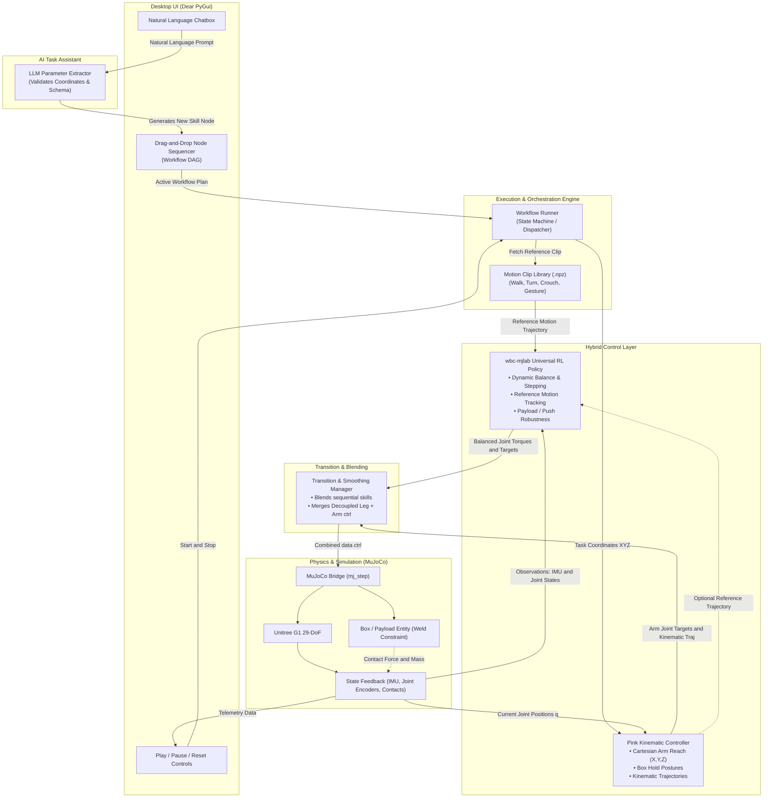

# System Design Document: Unitree G1 Humanoid Skill Orchestration Platform

## 1. Executive Summary

This platform enables visual, modular, and natural-language-driven control for the **Unitree G1 29-DOF Humanoid Robot** in MuJoCo. The system couples:
1. **Reinforcement Learning via `wbc-mjlab`**: A universal whole-body motion tracking RL policy trained natively in MuJoCo (leveraging MuJoCo Warp). Under the "one policy, many motions" paradigm, a single RL tracking policy handles dynamic balance, ground impacts, and payload stability across varying motion clips.
2. **Pre-Retargeted Motion Library**: Public G1 motion libraries (e.g. `exptech/g1-moves` and `openhe/g1-retargeted-motions`) providing instant, fluid human-like behaviors (walking, turning, crouching, waving) without individual reward engineering. Source clips are retargeted and re-gridded to the policy's 50 Hz frame clock before use.
3. **Pink Kinematic Tasks (QP-based Inverse Kinematics)**: For high-precision Cartesian end-effector positioning, arm reaching, and dynamic trajectory generation for mobile manipulation (e.g., carrying boxes).
4. **Decoupled Loco-Manipulation Mode**: Simultaneous execution where `wbc-mjlab` RL drives the lower-body bipedal locomotion while Pink actively stabilizes the arms to hold objects.
5. **AI Task Assistant & Chat Interface**: An LLM agent that parses natural language instructions (e.g., *"reach 25cm forward at table height and pick up the bearing box"*) into structured Pink task parameters.
6. **Drag-and-Drop Workflow Sequencer (Dear PyGui)**: A pure-Python desktop node editor allowing users to visually sequence, branch, and parameterize skills into automated workflows executed in MuJoCo.

---

## 2. High-Level Architecture



---

## 3. Subsystem Breakdown

### 3.1. Desktop UI & Node Sequencer (Dear PyGui)
* **Framework**: `dearpygui` (GPU-accelerated immediate mode GUI running at 60+ FPS in Python).
* **Components**:
  * **Node Editor Canvas (`dpg.add_node_editor`)**: Draggable node blocks representing atomic skills. Each node exposes input/output flow pins and tunable parameter fields (velocities, target coordinates, timeouts).
  * **Concurrent Lanes**: Supports parallel tracks for mobile manipulation (Track 1: Locomotion, Track 2: Upper-body Manipulation).
  * **Interactive Chat Panel**: Allows the user to type natural language commands. Newly created or edited task nodes appear directly inside the node canvas.
  * **Simulation Viewport**: Embedded MuJoCo passive viewer or side-by-side MuJoCo simulation window.

### 3.2. AI Task Assistant & Parameter Extractor
* **Declarative Pink Schema**: Translates natural language into Cartesian targets:
  - `body`: e.g. `"left_wrist_roll_link"`, `"right_wrist_roll_link"`
  - `position`: `[x, y, z]` (in meters relative to torso or world frame)
  - `orientation`: e.g. roll, pitch, yaw or quaternion
  - `task_type`: `"reach"`, `"hold_box"`, `"point"`, `"crouch"`
* **Extraction Schema**:
  ```json
  {
    "skill_type": "pink_reach",
    "parameters": {
      "target_body": "right_wrist_roll_link",
      "position": [0.35, -0.20, 0.85],
      "orientation_rpy": [0.0, 1.57, 0.0],
      "max_duration_sec": 3.0,
      "position_tolerance_m": 0.02
    }
  }
  ```
* **Safety Verification**: Workspace bounding box check ($x \in [0.1, 0.6]$, $y \in [-0.5, 0.5]$, $z \in [0.3, 1.3]$).

### 3.3. Kinematics Controller: Pink & Pinocchio
* **Role**: Whole-body inverse kinematics and task-space trajectory tracking.
* **Mechanism**: Solves a Quadratic Program (QP) at each control tick (50–100 Hz):
  $$\min_{\Delta q} \sum_{i} w_i \| J_i(q) \Delta q - v_i^* \|^2 + \lambda \|\Delta q\|^2$$
  $$\text{subject to } q_{min} \le q + \Delta q \le q_{max}, \quad |\Delta q| \le v_{max} \Delta t$$
* **Application**: 
  1. Instant millimeter-accurate reaching tasks while standing.
  2. Stabilizing arm poses relative to the chest during mobile box carrying.
* **Motion Preview (pre-commit validation)**: The Phase-1 Pink + `motion_tracker` path doubles as a **viewer-side best-case preview**. Before committing compute to RL training, a user can scrub a raw motion in the viewer to visually confirm the intended pose/timing — a cheap, kinematic "is this the motion I want?" check that is not a physics guarantee.

### 3.4. Reinforcement Learning via `wbc-mjlab`
* **Role**: Universal whole-body motion tracking with active bipedal balance and contact handling.
* **Architecture**:
  - Built natively for **MuJoCo** with GPU acceleration via MuJoCo Warp.
  - Implements **Adversarial Motion Priors (AMP) / DeepMimic** style tracking: a single policy neural network receives the robot's current state plus a reference window of future motion frames $[q_{ref}(t), q_{ref}(t+1), \dots]$.
  - The policy outputs PD target offsets that track the reference motion while actively modulating foot placement and torso momentum to prevent falls.
* **"One Policy, Many Motions"**:
  - Walking, turning, and crouching do not need separate training runs.
  - Different skills simply feed different reference `.npz` clips into the tracking policy.
* **Control clock (50 Hz frame contract)**:
  - The policy is a discrete-time controller with a fixed `policy_step_dt` of **0.02 s (50 Hz)**. The mapping "where am I → what forces" was learned at this cadence, so it must not change.
  - The policy consumes **exactly one clip frame per policy step**. Clips therefore must be **50 Hz**, or the reference plays at the wrong speed (a 60 fps clip would run 20% too fast). Raw clips at other rates (e.g. the 60 fps hackathon clips) are re-gridded to 50 Hz with linear + quaternion-slerp interpolation — the motion duration is preserved, only the frame grid changes.
* **Adding a new motion (retarget → fine-tune → export)**:
  1. **Retarget** the mocap / Blender animation onto the G1 skeleton (joint limits, limb lengths) and export as `.npz` in the wbc schema.
  2. **Resample to 50 Hz** (`src/controllers/clip_resample.py`, the same step used by `wbc-setup-clips`).
  3. **Fine-tune** the existing brain on a dataset containing the new clip rather than training from scratch. This reuses the general "how to be a balanced biped" knowledge and only adapts it to the new routine — far faster than a cold-start retrain.
  4. **Export** the updated brain to `policy.onnx` + `config.yaml` (`wbc-export`) for the deploy runtime.
  - The brain stores *skill*, not a fixed list of moves; new motions are added by continuing to train the same brain, so a single policy can accumulate many routines.
  - Fine-tuning is the mjlab **resume** path: `wbc-mjlab-train --task Wbc-G1 --dataset <set> --agent.resume true --agent.load-run <run> --agent.load-checkpoint <checkpoint>` loads the existing brain (`runner.load(...)`) and continues learning on the new dataset instead of starting from scratch.

### 3.5. Mobile Manipulation (Carrying Objects)
* **Decoupled Control**:
  - `wbc-mjlab` RL policy controls the legs and waist (15 DOFs) to maintain forward locomotion and dynamic balance.
  - Pink controls the arms (14 DOFs) to maintain Cartesian grip on the payload.
* **Payload Robustness**:
  - When the robot lifts a 2–4 kg box, the torso IMU senses forward pitch.
  - The RL policy's domain randomization instinctively adjusts foot timing and shifts the hips back by 2–3 cm to compensate for the shifted Center of Mass.
* **MuJoCo Grasp Stability**:
  - Utilizes MuJoCo's `<weld>` constraint to lock the box firmly between the end-effectors upon contact, preventing physics simulation slipping or jitter during the hackathon demonstration.

---

## 4. Workflow Schema Specification

```json
{
  "version": "1.0",
  "name": "Box Transport and Inspection Routine",
  "nodes": [
    {
      "id": "node_01",
      "type": "skill_wbc_track",
      "name": "Crouch to Box Height",
      "params": {
        "clip": "motions/crouch.npz",
        "duration_sec": 2.0
      },
      "next": "node_02"
    },
    {
      "id": "node_02",
      "type": "skill_pink_grasp",
      "name": "Clamp Hands on Box",
      "params": {
        "box_width_m": 0.35,
        "attach_weld": true
      },
      "next": "node_03"
    },
    {
      "id": "node_03",
      "type": "parallel_loco_manipulation",
      "name": "Carry Box to Station",
      "params": {
        "locomotion": {
          "type": "wbc_walk",
          "speed_mps": 0.4,
          "distance_m": 2.5
        },
        "manipulation": {
          "type": "pink_hold",
          "chest_offset": [0.35, 0.0, 0.75]
        }
      },
      "next": null
    }
  ]
}
```

---

## 5. Technology Stack & Dependencies

| Layer | Library / Tool | Purpose |
| :--- | :--- | :--- |
| **Physics Simulation** | `mujoco>=3.14.0` | High-fidelity dynamics simulation of the Unitree G1 humanoid |
| **Robot Assets** | `unitree_mujoco` (G1 MJCF & URDF) | Official G1 kinematic descriptions and meshes |
| **Whole-Body RL Tracking** | `wbc-mjlab` | Universal RL motion-tracking policy native to MuJoCo |
| **Pre-Retargeted Motions** | `exptech/g1-moves`, `openhe/g1-retargeted-motions` | 200+ pre-formatted G1 MoCap clips (.npz) |
| **Kinematics / QP** | `pink`, `pinocchio` | Real-time inverse kinematics and Cartesian task-space control |
| **Desktop UI** | `dearpygui` | GPU-accelerated desktop interface with native node graph editor |
| **Task Extraction** | `google-genai` / OpenAI API / Local LLM | Translates user natural language into structured Pink task parameters |
| **Package Manager** | `uv` / `pip` | Fast Python dependency resolution |

---

## 6. Implementation Roadmap

### Phase 1: Core Kinematics & Motion Clip Integration
- [x] MuJoCo G1 model loaded in viewer (`g1_29dof.xml`).
- [x] Implement standalone Pink arm reaching & Whole-Body CoM standing in MuJoCo.
- [x] Download and inspect sample G1 motion clips (`.npz`) from `g1-moves`.
- [x] **Motion preview tool**: viewer-side best-case playback of a raw clip via Pink + `motion_tracker`, used to sanity-check a motion before committing to training.

### Phase 2: WBC Physics Simulation Runner & Scripting Engine
- [x] Implement continuous high-frequency reference motion tracking (`src/controllers/motion_tracker.py`).
- [x] Build WBC closed-loop physics tracking runner with ONNX policy inference support (`src/controllers/wbc_runner.py`).
- [x] Build workflow scripting engine with composable skill nodes (`MotionClipNode`, `PinkReachNode`, `StandHoldNode`) in `src/engine/workflow_engine.py`.
- [x] Provide automated workflow execution script and headless test (`src/run_workflow.py`).
- [x] 50 Hz clip resampling (`src/controllers/clip_resample.py`), used by both the runtime and `wbc-setup-clips`.
- [ ] **Environment bring-up** (`wbc-sync`): install the wbc-mjlab RL environment (GPU torch + CUDA). Blocks all execution below.
- [ ] **Validate on samples**: `wbc-convert-samples` + `chain-samples` to confirm the chained runner tracks with the bundled checkpoint.
- [ ] **Train / fine-tune on the project clips**: `wbc-train` (fine-tune the bundled brain on `walk`/`step_touch`/`bow`, or cold-start on a small library).
- [ ] **Export deploy artifacts**: `wbc-export` → `models/params/policy.onnx` + `config.yaml`.
- [ ] **End-to-end chain**: `run_workflow --chain walk step_touch bow` with real physics, no pelvis anchoring.

> **Note on status**: the Phase-2 code is structurally complete and type-checks, but has not yet been executed — it requires the RL environment sync plus a trained/exported policy bundle to actually run. Roadmap items above marked `[ ]` are the remaining execution-and-validation steps.

### Phase 3: Dear PyGui Drag-and-Drop Sequencer
- [ ] Create main Dear PyGui desktop window with embedded/side-by-side MuJoCo simulation loop.
- [ ] Implement `dpg.node_editor` with custom nodes for Motion Clips, Pink Reaching, and Parallel Loco-Manipulation.
- [ ] Implement DAG exporter converting visual node connections into execution JSON.

### Phase 4: AI Task Assistant (Chatbox)
- [ ] Integrate a chatbox panel in Dear PyGui.
- [ ] Implement parameter extraction schema (converting user sentences into Pink target coordinates or motion clip selections).
- [ ] Add one-click "Add to Workflow" button spawning new nodes onto the canvas.

### Phase 5: End-to-End Validation
- [ ] Run complete scenario: Stand $\rightarrow$ Walk to Box $\rightarrow$ Pink Grasp $\rightarrow$ Carry Box while Walking $\rightarrow$ Place & Wave.
