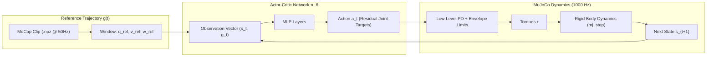
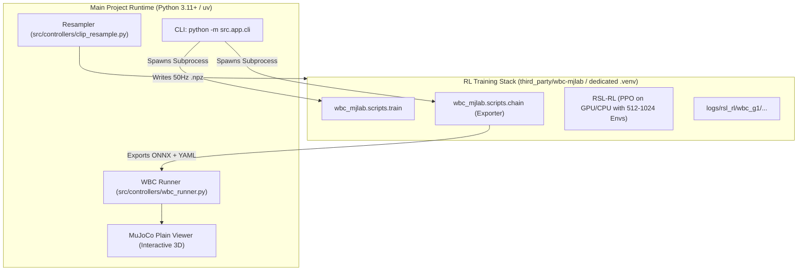

# Theory and Implementation: Humanoid Motion Tracking RL & Fine-Tuning

This document provides a comprehensive technical guide to the whole-body motion tracking reinforcement learning (RL) system for the **Unitree G1 29-DoF Humanoid Robot**. It covers the theoretical foundations of goal-conditioned RL for bipedal motion imitation, the mathematical formulation of rewards, Reference State Initialization (RSI), and early termination, followed by the exact software implementation and deployment pipeline in this repository.

---

## 1. Theoretical Foundations

### 1.1 The Motion-Tracking MDP Formulation

Humanoid motion tracking is framed as an infinite-horizon, goal-conditioned **Markov Decision Process (MDP)** defined by the tuple $\mathcal{M} = (\mathcal{S}, \mathcal{G}, \mathcal{A}, \mathcal{P}, \mathcal{R}, \gamma)$, where:
- $\mathcal{S}$ is the state space representing the robot's physical configuration and dynamics.
- $\mathcal{G}$ is the goal/reference space representing the target kinematic motion trajectory across time.
- $\mathcal{A}$ is the action space representing joint control targets.
- $\mathcal{P}(s_{t+1} \mid s_t, a_t)$ is the environmental transition probability governed by MuJoCo multi-body rigid dynamics and contact physics.
- $\mathcal{R}(s_t, g_t, a_t)$ is the scalar reward evaluating kinematic fidelity, dynamic stability, and effort regularization.
- $\gamma \in [0, 1)$ is the temporal discount factor.

The objective is to learn a policy $\pi_\theta(a_t \mid s_t, g_t)$ parameterized by weights $\theta$ that maximizes the expected discounted cumulative return:

$$J(\theta) = \mathbb{E}_{\tau \sim \pi_\theta} \left[ \sum_{t=0}^{T} \gamma^t \mathcal{R}(s_t, g_t, a_t) \right]$$



---

### 1.2 Observation Space & Goal Conditioning

At each discrete policy tick $t$ ($\Delta t = 0.02\,\text{s}$, $50\,\text{Hz}$), the actor network receives an observation vector combining **proprioceptive feedback** and **task-conditioned reference states**:

$$\mathbf{o}_t = \big[ \mathbf{o}_{\text{ref}}(t),\, \mathbf{o}_{\text{proprio}}(t),\, \mathbf{a}_{t-1} \big]$$

#### 1. Reference Observations $\mathbf{o}_{\text{ref}}(t)$
- **Reference Base Height** $z_{\text{ref}} \in \mathbb{R}^1$: Target root vertical position relative to ground.
- **Reference Base Linear Velocity** $\mathbf{v}_{\text{ref}}^b \in \mathbb{R}^3$: Target linear velocity expressed in the robot base frame.
- **Reference Base Angular Velocity** $\boldsymbol{\omega}_{\text{ref}}^b \in \mathbb{R}^3$: Target angular velocity expressed in the robot base frame.
- **Reference Gravity Vector** $\mathbf{g}_{\text{ref}}^b \in \mathbb{R}^3$: Projected gravitational vector corresponding to the target torso orientation:
  $$\mathbf{g}_{\text{ref}}^b = \mathbf{R}_{\text{ref}}^T \begin{bmatrix} 0 \\ 0 \\ -1 \end{bmatrix}$$
- **Reference Joint Positions** $\mathbf{q}_{\text{ref}} \in \mathbb{R}^{29}$: Target joint angles for all actuated degrees of freedom.

#### 2. Proprioceptive Feedback $\mathbf{o}_{\text{proprio}}(t)$
- **Base Angular Velocity** $\boldsymbol{\omega}^b \in \mathbb{R}^3$: Measured torso IMU gyro reading.
- **Projected Gravity** $\mathbf{g}^b \in \mathbb{R}^3$: Actual orientation of gravity vector relative to the torso IMU.
- **Joint Positions** $\mathbf{q} \in \mathbb{R}^{29}$: Current encoder measurements.
- **Joint Velocities** $\dot{\mathbf{q}} \in \mathbb{R}^{29}$: Filtered joint velocity estimates.
- **Previous Action** $\mathbf{a}_{t-1} \in \mathbb{R}^{29}$: Action applied at the previous timestep (enforces temporal smoothness).

---

### 1.3 Action Space & Low-Level Actuation

The policy operates in the space of **residual joint positions**. Rather than predicting raw torques directly (which suffers from severe high-frequency sample inefficiency and sim-to-real transfer gaps), the policy outputs normalized target offsets:

$$\mathbf{q}_{\text{des}} = \mathbf{q}_{\text{default}} + \mathbf{a}_t$$

The joint-level actuators track these targets via high-rate Proportional-Derivative (PD) control running at the simulation frequency ($500\,\text{Hz} - 1000\,\text{Hz}$):

$$\boldsymbol{\tau}_{\text{raw}} = \mathbf{K}_p (\mathbf{q}_{\text{des}} - \mathbf{q}) - \mathbf{K}_d \dot{\mathbf{q}}$$

#### Actuator Envelope & Motor Saturation
Real brushless motors (such as Unitree's M107 and A80 actuators on the G1) exhibit torque-speed constraints dictated by back-EMF and inverter current saturation. The applied torque is clipped using a continuous piecewise motor envelope function:

$$\tau_i = \text{clip}\left( \tau_{\text{raw}, i} - \tau_{\text{friction}}(\dot{q}_i),\, -\tau_{\max}(\dot{q}_i),\, \tau_{\max}(\dot{q}_i) \right)$$

where $\tau_{\max}(\dot{q})$ defines the corner speed and peak torque curve for each joint group (knees, hips, shoulders, ankles).

---

### 1.4 Reward Formulation (Zest / Table S4 Tracking)

The reward function guides the policy to closely track motion capture trajectories while maintaining energetic economy and dynamic balance.

Rather than narrow, brittle Gaussian kernels $\exp(-\|e\|^2 / 2\sigma^2)$, the system employs **Zest-style exponential kernels** with a stiffness parameter $\kappa = 0.25$:

$$r_{\text{track}}(e, \sigma) = \exp\left( -\kappa \frac{\|e\|^2}{\sigma^2} \right)$$

This wider exponential basin provides meaningful gradients even when the robot exhibits moderate tracking error during dynamic transitions.

#### Reward Components

| Term | Weight | Error Metric $e$ | Scale $\sigma$ | Purpose |
| :--- | :--- | :--- | :--- | :--- |
| `motion_global_root_pos` | $1.0$ | $\| \mathbf{p}_{\text{root}} - \mathbf{p}_{\text{ref}} \|$ | $0.4\,\text{m}$ | Anchor base position in world |
| `motion_global_root_ori` | $1.0$ | $2 \arccos(|\mathbf{q}_{\text{root}} \cdot \mathbf{q}_{\text{ref}}|)$ | $0.5\,\text{rad}$ | Pelvis attitude & heading |
| `motion_root_lin_vel_b` | $1.0$ | $\| \mathbf{v}_{\text{root}}^b - \mathbf{v}_{\text{ref}}^b \|$ | $0.6\,\text{m/s}$ | Base translational velocity |
| `motion_root_ang_vel_b` | $1.0$ | $\| \boldsymbol{\omega}_{\text{root}}^b - \boldsymbol{\omega}_{\text{ref}}^b \|$ | $1.5\,\text{rad/s}$ | Base rotational velocity |
| `motion_body_pos` | $1.0$ | $\sum_{b} \| \mathbf{p}_b - \mathbf{p}_{b, \text{ref}} \|^2$ | $0.2\,\text{m}$ (per body) | Keybody Cartesian positions |
| `motion_body_ori` | $1.0$ | $\sum_{b} \|\Delta \mathbf{q}_b\|^2$ | $0.4\,\text{rad}$ (per body) | Keybody Cartesian attitudes |
| `motion_joint_pos` | $1.0$ | $\| \mathbf{q} - \mathbf{q}_{\text{ref}} \|$ | $0.3\,\text{rad}$ (per joint) | Internal pose tracking |
| `motion_body_lin_vel` | $0.5$ | $\| \mathbf{v}_b - \mathbf{v}_{b, \text{ref}} \|$ | $1.0\,\text{m/s}$ | End-effector momentum |
| `motion_body_ang_vel` | $0.5$ | $\| \boldsymbol{\omega}_b - \boldsymbol{\omega}_{b, \text{ref}} \|$ | $\pi\,\text{rad/s}$ | Limb angular momentum |

#### Regularization Penalties

$$\mathcal{R}_{\text{reg}} = r_{\text{survival}} - 0.1 \|\mathbf{a}_t - \mathbf{a}_{t-1}\|_1 - 5 \times 10^{-6} \|\ddot{\mathbf{q}}\|^2 - 1.0 \cdot \mathbb{I}_{\text{joint limit}} - 0.1 \cdot \text{soft\_torque\_penalty}$$

- **Survival Bonus** ($+1.0$): Encourages staying upright throughout the episode.
- **Action Rate L1 Penalty** ($-0.1$): Suppresses high-frequency chatter in joint position demands.
- **Joint Acceleration Penalty** ($-5 \times 10^{-6}$): Damps mechanical shock and torque spikes.
- **Soft Torque Penalty** ($-0.1$): Penalizes operating beyond $90\%$ of rated motor continuous torque.

---

### 1.5 Reference State Initialization (RSI) & Adaptive Binning

A well-known challenge in bipedal RL is that sequential rollouts initialized exclusively from $t=0$ suffer from **compounding error**: if a robot falls at $t=1.5\,\text{s}$, states at $t > 1.5\,\text{s}$ are never explored, causing the policy to overfit to the first few frames.

**Reference State Initialization (RSI)** addresses this by initializing environments at random time offsets along the reference clip:

$$t_0 \sim \mathcal{U}(0,\, T_{\text{clip}})$$

#### Adaptive Bin Sampling
Uniform random sampling over-allocates samples to easy segments (e.g. steady-state walking) while under-sampling difficult phases (e.g., flight phase in a sprint or touchdown in a jump).

The implementation partitions each motion into temporal bins (width $\Delta t_{\text{bin}} = 4.0\,\text{s}$) and tracks empirical tracking reward and failure rates across each bin. Bins with lower survival rates are sampled with higher probability:

$$P(\text{bin}_k) \propto \left(1 - \bar{R}_k\right)^\alpha + \epsilon$$

This automatically focuses gradient updates on dynamic transition boundaries.

---

### 1.6 Early Termination (ET)

To maximize sample efficiency, episodes terminate early as soon as the robot enters an unrecoverable state:
1. **Root Divergence**: Global base position deviates from reference by $> 0.35\,\text{m}$.
2. **End-Effector Height Collapse**: Foot or hand vertical position deviates from reference $z$ by $> 0.25\,\text{m}$ (detects slips and ground collapses).
3. **Impact Force Overload**: Ground contact force on any keybody exceeds $2000\,\text{N}$ (detects falls or destructive ground impacts).

---

### 1.7 Theory of Fine-Tuning vs. Scratch Training

```mermaid
graph TD
    subgraph Scratch ["Training From Scratch (Cold Start)"]
        RandInit["Random Weights θ ~ N(0, σ²)"] --> AssistWrench["Assistive Upward Wrench Required"]
        AssistWrench --> Millions["Millions of Steps to Discover Contact"]
        Millions --> LocalMin["Prone to Suboptimal Locomotion Gaits"]
    end

    subgraph FineTuning ["Fine-Tuning / Warm-Start (Our Approach)"]
        Pretrained["Pretrained Foundation Policy (Bundled G1 Model)"] --> ReusePrior["Reuses Universal Bipedal Dynamics & Balance"]
        ReusePrior --> FocusedLearn["Adapts to New Target Clip Distribution"]
        FocusedLearn --> Rapid["Rapid Convergence (<3,000 Iterations)"]
    end
```



#### Why Warm-Start Fine-Tuning Works
1. **Reusing Dynamic Invariants**: A bipedal humanoid's dynamics (center of mass height, ground reaction limits, inverted pendulum mechanics) are identical regardless of whether it is walking, dancing, or bowing. Training from scratch wastes millions of transitions discovering that the robot falls when it doesn't place its foot under its center of pressure.
2. **Conditioned Manifold Adaptation**: The actor network has already learned to project $\mathbf{o}_{\text{ref}}$ into a stable manifold of joint torques. Fine-tuning adjusts the attention and intermediate representation to accommodate new reference trajectories without disturbing the low-level stabilization reflexes.
3. **PPO Stability Under Warm-Start**: Using a clipped surrogate objective with an entropy regularizer prevents policy collapse when fine-tuning:
   $$L^{\text{CLIP}}(\theta) = \hat{\mathbb{E}}_t \left[ \min\left( r_t(\theta)\hat{A}_t,\, \text{clip}(r_t(\theta), 1-\epsilon, 1+\epsilon)\hat{A}_t \right) \right]$$
   With $\epsilon = 0.2$ and small learning rates ($\eta \sim 10^{-4}$), policy parameters smoothly adjust to the new reference distributions without catastrophic forgetting of balance reflexes.

---

## 2. Repository Implementation

### 2.1 Two-Tier Subsystem Isolation

The codebase maintains clean separation between the user-facing deployment runtime and the GPU RL training stack:



- **Main Runtime**: Pure Python, MuJoCo (`mujoco>=3.14.0`), `onnxruntime`, and `numpy`. No PyTorch or CUDA runtime dependencies required for deployment or previewing.
- **Training Runtime (`third_party/wbc-mjlab`)**: Isolated environment managing PyTorch, CUDA 12.8, `rsl_rl`, and batched parallel vector environments.

---

### 2.2 The 50 Hz Frame Synchronization Contract

The trained RL policy operates on a fixed discrete-time schedule:

$$\Delta t_{\text{policy}} = 0.02\,\text{s} \quad (50\,\text{Hz})$$

At each policy step, the controller advances **exactly one frame** of the reference motion clip. If a MoCap clip recorded at $60\,\text{Hz}$ or $120\,\text{Hz}$ were fed directly into the policy, it would play at incorrect speeds, distorting the velocity tracking errors.

To preserve kinematics, [`src/controllers/clip_resample.py`](file:///mnt/idfk/programming_stuff/SKF_Hackathon/src/controllers/clip_resample.py) resamples raw clips to exactly $50\,\text{Hz}$:
- **Cartesian Positions and Velocities**: Linear interpolation across continuous timestamps.
- **Body Attitudes (Unit Quaternions)**: Spherical Linear Interpolation (Slerp) with antipodal sign alignment:
  $$\text{if } \mathbf{q}_0 \cdot \mathbf{q}_1 < 0 \implies \mathbf{q}_1 \leftarrow -\mathbf{q}_1$$
  $$\text{Slerp}(\mathbf{q}_0, \mathbf{q}_1; w) = \frac{\sin((1-w)\theta)}{\sin\theta} \mathbf{q}_0 + \frac{\sin(w\theta)}{\sin\theta} \mathbf{q}_1$$

---

### 2.3 Training & Fine-Tuning Pipeline (`src/app/controller.py`)

The orchestration API is implemented in [`SkillApp`](file:///mnt/idfk/programming_stuff/SKF_Hackathon/src/app/controller.py):

#### Setup & Ingestion
```python
def setup(self) -> int:
    # 1. Sync wbc-mjlab environment dependencies
    # 2. Convert sample motions to WBC-standard NPZ
    # 3. Resample all clips in data/motions/ to 50 Hz into third_party/wbc-mjlab/data/g1/hackathon/npz/
```

#### Training Dispatch
```python
def train(self, cfg: TrainConfig | None = None) -> int:
    cfg = cfg or TrainConfig()
    args = [
        _wbc_python(),
        "-m", "wbc_mjlab.scripts.train",
        "--task", "Wbc-G1",
        "--dataset", "hackathon",
        "--env.scene.num-envs", str(cfg.envs),
        "--agent.max-iterations", str(cfg.iterations),
        "--agent.save-interval", str(cfg.save_interval),
    ]
    if cfg.from_bundled:
        args += self._resume_from_bundled_args()
    _run(args, cwd=WBC_DIR)
```

#### Warm-Start Checkpoint Resume (`_resume_from_bundled_args`)
To fine-tune from the bundled foundation model:
1. Copies `third_party/wbc-mjlab/demos/wbc_g1/model.pt` to `logs/rsl_rl/wbc_g1/bundled/model_0.pt`.
2. Passes `--agent.resume True --agent.load-run bundled --agent.load-checkpoint model_0.pt`.
3. Loads the actor-critic weights directly into `RslRlVecEnvRunner`, skipping cold initialization.

---

### 2.4 Model Export Pipeline

Once training or fine-tuning completes, [`SkillApp.export()`](file:///mnt/idfk/programming_stuff/SKF_Hackathon/src/app/controller.py) executes:
```bash
python -m wbc_mjlab.scripts.chain \
    --motion-source data/g1/hackathon \
    --chain walk \
    --export-models models/ \
    --checkpoint-file <path_to_latest_model.pt>
```

This generates the deployment bundle in [`models/params/`](file:///mnt/idfk/programming_stuff/SKF_Hackathon/models/params):
1. **`policy.onnx`**: Optimized ONNX graph of the trained actor network with frozen weights.
2. **`config.yaml`**: Manifest defining:
   - Ordered list of observation term names and dimensions.
   - Per-joint PD proportional ($K_p$) and derivative ($K_d$) gains.
   - Default standing joint angles $\mathbf{q}_{\text{default}}$.
   - Action scaling factor ($\text{scale} = 0.25$).
3. **`rsi_bin_stats.npz`**: Empirical bin coverage statistics.

---

### 2.5 Real-Time Inference Runtime (`src/controllers/wbc_runner.py`)

The deployment engine runs entirely in plain MuJoCo without torch or GPU overhead:

```python
class WbcRunner:
    def __init__(self, mj_model, mj_data, clip_path, model_dir):
        # 1. Load policy.onnx via ONNX Runtime
        self.session = ort.InferenceSession(str(model_dir / "policy.onnx"))
        # 2. Parse config.yaml (schema: wbc_tracking_params_v1)
        # 3. Load 50Hz ClipReference
```

At each control cycle:
1. **Observation Assembly**: Gathers root position/velocity, joint angles, IMU orientation, and targets from `ClipReference`.
2. **ONNX Forward Pass**: Computes residual action $\mathbf{a}_t = \pi(\mathbf{o}_t)$.
3. **Actuation & Envelope Limiting**:
   $$\mathbf{q}_{\text{des}} = \mathbf{q}_{\text{default}} + 0.25 \cdot \mathbf{a}_t$$
   $$\boldsymbol{\tau} = \mathbf{K}_p (\mathbf{q}_{\text{des}} - \mathbf{q}) - \mathbf{K}_d \dot{\mathbf{q}}$$
   Applies joint torque envelopes and friction compensation.
4. **Substep Physics**: Steps MuJoCo simulation forward across 20 substeps ($\Delta t_{\text{sim}} = 0.001\,\text{s}$).

---

## 3. Practical Workflows (CLI)

### 3.1 Initial Environment Bring-Up
Resamples all motion clips to $50\,\text{Hz}$ and initializes the training dataset:
```bash
just wbc-setup
```

### 3.2 Fine-Tuning on Staged Motions
Fine-tune the bundled brain on your current clip library (e.g. 512 parallel environments for 3,000 iterations):
```bash
just wbc-finetune envs="512" iters="3000"
```

### 3.3 Training from Scratch (Optional)
If training an entirely new morphology or un-pretrained architecture:
```bash
just wbc-train envs="1024" iters="15000"
```

### 3.4 Exporting to ONNX
Converts the latest checkpoint into the deployment package:
```bash
just wbc-export
```

### 3.5 Evaluating the Trained Policy
Simulate the trained policy across a chained motion sequence:
```bash
just play-chain clips="walk run1 sprint1 bow"
```

---

## 4. Hyperparameter Summary

| Parameter | Recommended Value | Description |
| :--- | :--- | :--- |
| `policy_dt` | $0.02\,\text{s}$ ($50\,\text{Hz}$) | Discrete policy inference step |
| `physics_dt` | $0.001\,\text{s}$ ($1000\,\text{Hz}$) | MuJoCo numerical integration step |
| `num_envs` | $512$ (Laptop) / $1024$ (Workstation) | Vectorized parallel simulation count |
| `max_iterations` | $3,000$ (Fine-tuning) / $20,000$ (Scratch) | PPO outer iterations |
| `save_interval` | $250$ iterations | Checkpoint frequency |
| `learning_rate` | $3.0 \times 10^{-4}$ (with cosine decay) | Adam optimizer rate |
| `clip_param` | $0.2$ | PPO surrogate clipping ratio $\epsilon$ |
| `entropy_coef` | $0.005$ | Exploration bonus |
| `gamma` | $0.99$ | Discount factor |
| `lam` (GAE) | $0.95$ | Generalized Advantage Estimation parameter |
| `action_scale` | $0.25\,\text{rad}$ | Multiplier on normalized action outputs |
